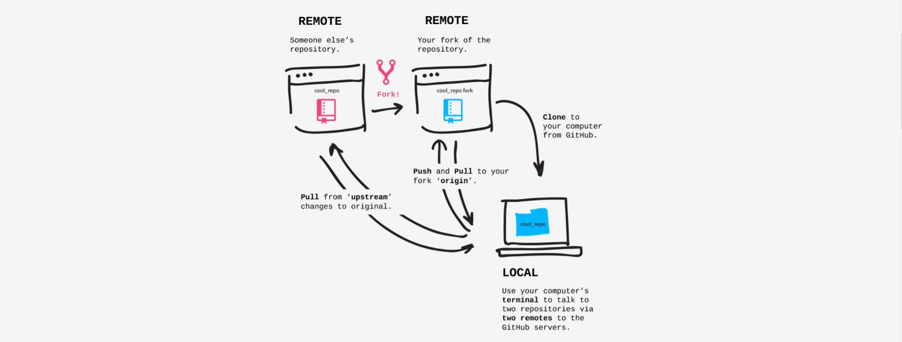

# github_usage
notes about github usage

### Tutorial
#### [Git-it](http://jlord.us/git-it/)
- Get git
  - Install
  
    Windows: It's recommended to download GitHub for Windows, which includes Git and has an easier install: [windows.github.com](http://windows.github.com/). Use the Git Shell for your terminal.
    
    Mac: You can also download GitHub for Mac, which includes Git, mac.github.com (from Preferences, select the command line tools install), or download Git by itself at: [git-scm.com/downloads](http://git-scm.com/downloads) and follow the installation instructions.
  
  - Configure
  
    Open **terminal** (or Bash)
    - Verify installation:  `$ git --version`
    - Set name: `$ git config --global user.name "<Your Name>"`
    - Set email: `$ git config --global user.email "<youremail@example.com>"`
    
- Repository
  
  A _**repository**_ is essentially a project. You can imagine it as a project's folder with all the related files inside of it. In fact, that's what it will look like on your computer anyways.
  
  - Create a Repository
  
    - To make a new folder: `$ mkdir hello-world`
    - To go into that folder: `$ cd hello-world`
    - To create a new Git instance for a project: `$ git init`
    - Verify if it's a Git repo: `$ git status`
  
- Commit it
  - Create a New File, e.g. readme.txt under hellow_world folder
  - Status, Add and Commit Changes
    - Check repo status: `$ git status`
    - Add file to do commit: `$ git add readme.txt` (tell git which file you gonna commit)
    - Commit file: `$ git commit -m "<your commit message>"`
  - Make More Changes
    -  view the difference between the file now and how it was at your last commit : `$ git diff`

- Use GitHub
  - Create a GitHub Account : [github.com](http://github.com/)
  - Add username to Git
  
    Add your GitHub username to your Git configuration : `$ git config --global user.username <USerNamE>`
  
- Remote Control
  
  Connect your local and remote repositories and push changes. (push / pull)
  - Create a Remote Repository   
    - Create a new repo on Github, make it's name exactly same as your local repository's name. 
    - Make it public.
    - Don't initialize with a README because we already have a file, locally, named 'readme.txt'.
    - Leave .gitignore and license on 'none'.
  
  - Connect your Local to your Remote : `$ git remote add origin <URLFROMGITHUB>`
  - Push Work to your Remote : `$ git push origin master`
  
  - Other operations:
    - Add remote connections : `$ git remote add <REMOTENAME> <URL>`
    - Set a URL to a remote : `$ git remote set-url <REMOTENAME> <URL>`
    - Pull in changes : `$ git pull <REMOTENAME> <BRANCHNAME>`
    - View remote connections : `$ git remote -v`
    - Push changes : `$ git push <REMOTENAME> <BRANCH>`

- Forks And Clones
  
  When you _**fork**_ a repository, you're creating a copy of it on your GitHub account. Forks are used for creating your own version of a project or contributing back fixes or features to the original project.
  
  Once a project is forked, you then _**clone**_ (aka copy) it from GitHub to your computer to work on locally.
  
  
  Fork a repo to your Github, then copy it's URL, then clone it locally:
  `$ git clone <URLFROMGITHUB>`
  
  Now you've got a copy of the repository on your computer and it is automatically connected to the remote repository (your forked copy) on your GitHub account.
  
  - Connect to the Original Repository
    - get the URL of the original repo
    - `$ git remote add upstream <originalRepoURL>`
    
- Branches

  Create a new branch on your fork for your contribution.
  
  Git repositories use branches to isolate work when needed. It's common practice when working on a project or with others on a project to create a branch to keep your changes in until they are ready. This way you can do your work while the main, commonly named 'master', branch stays stable. When your branch is ready, you merge it back into 'master'.
  
  
