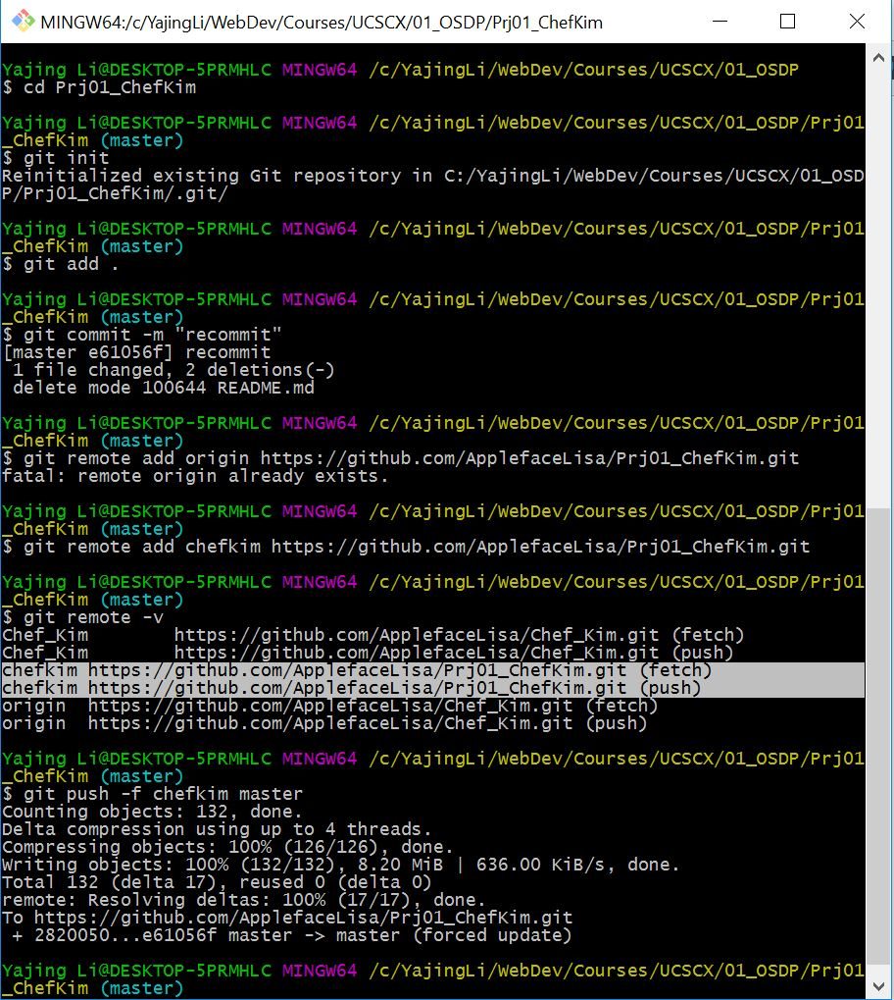

# How to adding an existing project to GitHub using the command line

- Create a new repository on GitHub. 

  To avoid errors, _**do not**_ initialize the new repository with README, license, or gitignore files. You can add these files after your project has been pushed to GitHub.
  
- Open Git Bash.

- Change the current working directory to your local project.

- Initialize the local directory as a Git repository.
  ```
  $ git init
  ```
  
- Add the files in your new local repository. This stages them for the first commit.
  ```
  $ git add .
  ```
  
- Commit the files that you've staged in your local repository.
  ```
  $ git commit -m "First commit"
  ```
  
- At the top of your GitHub repository's Quick Setup page, copy the remote repository URL.

- In the Command prompt, add the URL for the remote repository where your local repository will be pushed.
  ```
  $ git remote add origin remote_repository_URL
  # Sets the new remote
  $ git remote -v
  # Verifies the new remote URL
  ```
  
- Push the changes in your local repository to GitHub.
  ```
  $ git push -f origin master       // force push
  ```
  
  ### Example
  
  
  
# Reference

- github help [Adding an existing project to GitHub using the command line](https://help.github.com/articles/adding-an-existing-project-to-github-using-the-command-line/)

- stackoverflow [Issue pushing new code in Github](http://stackoverflow.com/questions/20939648/issue-pushing-new-code-in-github)
